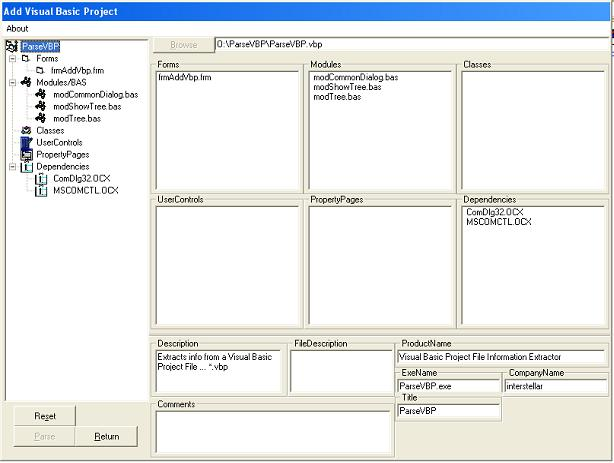



## ParseVBP \[Updated\!\!\!\]

### Description

Newly Updated with TREEVIEW added... check out the screenshot!

Ever wanted to extract the info quickly from your Visual Basic Project file? Use this to code to do that... grab the information, like dependencies, forms, classes, ect..., use the info in another project... Make your own SourceSafe or Project Organizer.

This code teaches how to parse a file and how to use common dialog. Enjoy!!
 
### More Info
 
Visual Basic Project File

I've made the TreeView module very simple to use, anyone can use it =)

Seperated information from within the VBP file.

Forms...

Classes...

Modules...

ETC...

             |
---                |---
**Submitted On**   |2002-06-08 14:48:00
**By**             |[Michael Heath](https://github.com/Planet-Source-Code/PSCIndex/blob/master/ByAuthor/michael-heath.md)
**Level**          |Intermediate
**User Rating**    |5.0 (15 globes from 3 users)
**Compatibility**  |VB 5\.0, VB 6\.0
**Category**       |[Files/ File Controls/ Input/ Output](https://github.com/Planet-Source-Code/PSCIndex/blob/master/ByCategory/files-file-controls-input-output__1-3.md)
**World**          |[Visual Basic](https://github.com/Planet-Source-Code/PSCIndex/blob/master/ByWorld/visual-basic.md)
**Archive File**   |[ParseVBP\_\[91934682002\.zip](https://github.com/Planet-Source-Code/michael-heath-parsevbp-updated__1-35603/archive/master.zip)

